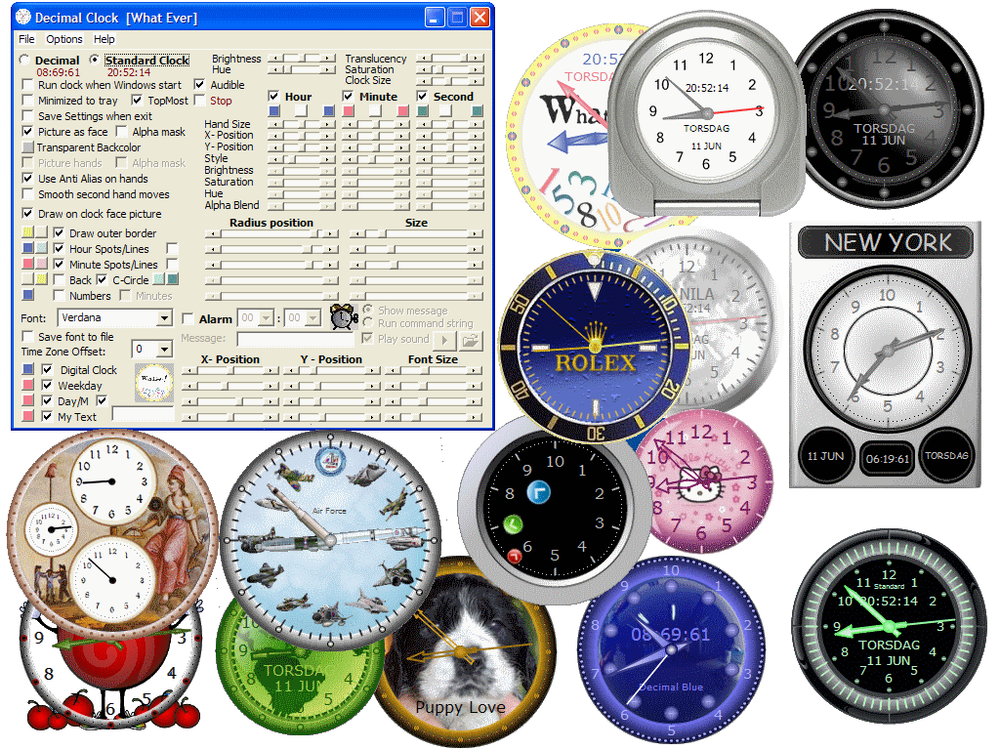



## Updated\!  Decimal Analogue Clock  \(Ver\.  2\.0\.0\)

### Description

In this updated version, you can select your own picture as clock face, or draw one with the built in functions. Select your own clock hand picture, or use any of the built in hand styles. Create both decimal and standard clocks. Save your clock to a disk file. This files is associated to the exe-file, and can be started if double click them or when Windows start. This project including 27 sample clocks created in this application.

Decimal time is the representation of the time of day using units, which are decimally related. This term is often used to refer specifically to French Revolutionary Time, which divides the day into 10 decimal hours, each decimal hour into 100 decimal minutes and each decimal minute into 100 decimal seconds, as opposed to the more familiar standard time, which divides the day into 24 hours, each hour into 60 minutes and each minute into 60 seconds.
 
### More Info
 

             |
---                |---
**Submitted On**   |2009-06-11 23:34:00
**By**             |[Jan Andersson](https://github.com/Planet-Source-Code/PSCIndex/blob/master/ByAuthor/jan-andersson.md)
**Level**          |Intermediate
**User Rating**    |5.0 (20 globes from 4 users)
**Compatibility**  |VB 6\.0
**Category**       |[Math/ Dates](https://github.com/Planet-Source-Code/PSCIndex/blob/master/ByCategory/math-dates__1-37.md)
**World**          |[Visual Basic](https://github.com/Planet-Source-Code/PSCIndex/blob/master/ByWorld/visual-basic.md)
**Archive File**   |[Updated\!\_\_2154746112009\.zip](https://github.com/Planet-Source-Code/jan-andersson-updated-decimal-analogue-clock-ver-2-0-0__1-72092/archive/master.zip)

